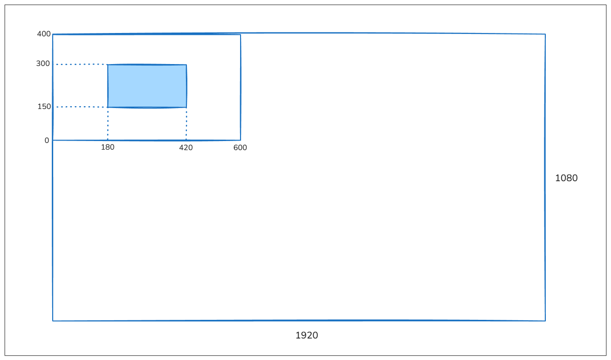

## Exercício 1: Conversão SRU → SRT (2D)
Um retângulo é definido no SRU (Sistema de Referência do Universo) pelas coordenadas do canto inferior esquerdo (2, 4) e superior direito (8, 10). 

O recorte (ou a janela de visualização - Window) no SRU é definida por Xmin=0, Xmax=10, Ymin=0, Ymax=12.

A viewport (área de desenho na tela em pixels) será definida dentro de uma janela de aplicação de 600 x 400 pixels, que por sua vez está posicionada no canto superior esquerdo de uma tela de 1920x1080 pixels, com:
- Canto inferior esquerdo da viewport: (100, 50) (relativo à janela)
- Largura: 400 pixels
- Altura: 300 pixels

### Perguntas:
1. Quais são as coordenadas do retângulo na viewport (coordenadas de tela em pixels)?

**Resposta:**

    1. Cálculo das coordenadas na viewport

**Fatores de escala:**

    EscalaX = largura da viewport / (Xmax - Xmin) = 400 / (10 - 0) = 400 / 10 = 40
    EscalaY = altura da viewport/ (Ymax - Ymin) = 300 / (12 - 0) = 300 / 12 = 25

**Conversão do canto inferior esquerdo do retângulo (2, 4):**

    U = Início da Viewport em X + (XPonto – Xmin) x EscalaX = 100 + (2 - 0) × 40 = 100 + 80 = 180

    V = Início da Viewport em Y + (YPonto – Ymin) x EscalaY = 50 + (4 - 0) × 25 = 50 + 100 = 150

    Coordenada na Viewport: (180, 150)

**Conversão do canto superior direito do retângulo (8, 10):**
    U = Início em X + (Xmax – Xmin) x EscalaX = 100 + (8 - 0) × 40 = 100 + 320 = 420

    V = Início em Y + (Ymax – Ymin) x EscalaY = 50 + (10 - 0) × 25 = 50 + 250 = 300
    
    Coordenada na Viewport: (420, 300)

**Resposta: As coordenadas do retângulo na viewport (relativas à janela de aplicação) são:**

    - Canto Inferior Esquerdo: (180, 150)
    - Canto Superior Direito: (420, 300)

2. Esboce um desenho mostrando a tela, a janela de aplicação, a viewport, e a posição do retângulo.

**Resposta:**

## Exercício 2: Visualização de Triângulo com Viewport Integral
Você precisa visualizar o triângulo com vértices A(-1, 2), B(3, 5) e C(4, 0) em uma viewport que ocupa toda a janela de aplicação de 800×600 pixels, posicionada no canto superior esquerdo da tela.

### Perguntas:
1. Quais são os valores Xmin, Xmax, Ymin, Ymax da janela de visualização (Window) para enquadrar o triângulo com margem de 0.5 unidades?

**Resposta:**

    - X: mínimo = -1, máximo = 4 → Xmin = -1,5 | Xmax = 4,5
    - Y: mínimo = 0, máximo = 5 → Ymin = -0,5 | Ymax = 5,5

2. Quais são as coordenadas dos vértices na viewport?

**Resposta:**

    EscalaX = 800/6 = 133,33

    EscalaY = 600/6 = 100

    - A(-1,2) → U = (-1-(-1,5))×133,33 = 66,67 | V = (2-(-0,5))×100 = 250 → (66,67 ; 250)
    - B(3,5) → U = (3-(-1,5))×133,33 = 600 | V = (5-(-0,5))×100 = 550 → (600 ; 550)
    - C(4,0) → U = (4-(-1,5))×133,33 = 733,33 | V = (0-(-0,5))×100 = 50 → (733,33 ; 50)

## Exercício 3: Transformação de Múltiplos Objetos

Uma cena contém três objetos no SRU (Sistema de Referência do Universo):
1. Triângulo: Vértices A(2, 3), B(5, 3), C(3, 6)
2. Retângulo: Cantos inferior esquerdo (1, 1) e superior direito (4, 2)
3. Círculo: Centro (4, 4) com raio 1

A viewport ocupa o canto superior esquerdo da tela com dimensões 600×400 pixels. A janela de visualização (recorte) é definida por Xmin=0, Xmax=8, Ymin=0, Ymax=8.

### Perguntas:
1. Quais são as coordenadas dos vértices do triângulo na viewport (0, 0, 800, 600)?

**Resposta:**

    EscalaX = 800/8 = 100 | EscalaY = 600/8 = 75
    
    - A(2,3) → (200 ; 225)
    - B(5,3) → (500 ; 225)
    - C(3,6) → (300 ; 450)

2. Quais são as coordenadas dos cantos do retângulo na viewport (200, 100, 600, 500)?

**Resposta:**

    EscalaX = 600/8 = 75 | EscalaY = 500/8 = 62,5
    
    - Inferior esquerdo (1,1) → U = 200+(1)×75 = 275 | V = 100+(1)×62,5 = 162,5 → (275 ; 162,5)
    - Superior direito (4,2) → U = 200+(4)×75 = 500 | V = 100+(2)×62,5 = 225 → (500 ; 225)

3. Quais são as coordenadas do centro e qual o comprimento do raio do círculo nas duas viewports?

**Resposta:**

    - Viewport (0,0,800,600) — EscalaX=100, EscalaY=75:
    Centro → U = 400, V = 300 → (400 ; 300)
    Raio: como EscalaX ≠ EscalaY, o círculo vira uma elipse com semieixo X = 100 e semieixo Y = 75.

    - Viewport (200,100,600,500) — EscalaX=75, EscalaY=62,5:
    Centro → U = 200+300=500, V = 100+250=350 → (500 ; 350)
    Semieixo X = 75, semieixo Y = 62,5 (também vira elipse).

    Como as escalas X e Y são diferentes nas duas viewports, um círculo perfeito no SRU não se mantém circular na tela virando elipse.

## Exercício 4: Diferentes Viewports na Mesma Janela

Um triângulo possui vértices P(10, 10), Q(50, 10), R(30, 40) no SRU. A janela de visualização (recorte) é Xmin=0, Xmax=100, Ymin=0, Ymax=100.

### Perguntas:
1. Quais são as coordenadas na viewport1 (0, 0, 800, 600)?

**Resposta:**

    EscalaX = 800/100 = 8 | EscalaY = 600/100 = 6
    
    - P(10,10) → (80 ; 60)
    - Q(50,10) → (400 ; 60)
    - R(30,40) → (240 ; 240)

2. Quais são as coordenadas na viewport2 (200, 100, 600, 500)?

**Resposta:**

    EscalaX = 600/100 = 6 | EscalaY = 500/100 = 5
    
    - P(10,10) → U=200+60=260 | V=100+50=150 → (260 ; 150)
    - Q(50,10) → U=200+300=500 | V=150 → (500 ; 150)
    - R(30,40) → U=200+180=380 | V=100+200=300 → (380 ; 300)

3. Compare os triângulos nas duas viewports considerando a apresentação em uma janela de 500 x 500 pixels.

**Resposta:**

    - Ambas as viewports (800×600 e 600×500) são maiores que a janela de 500×500, ou seja, nenhuma das duas viewports cabe inteiramente dentro da área visível; parte delas ficaria fora da tela.

    - Mesmo assim, os vértices calculados acima caem dentro do intervalo 0–500 nos dois casos (no viewport2, Q fica exatamente na borda, x=500), então o triângulo em si ainda aparece completo, só que perto da borda direita/inferior da área visível.

    - O triângulo da viewport1 é maior (largura 320 × altura 180) que o da viewport2 (largura 240 × altura 150), porque as escalas de viewport1 (8 e 6) são maiores que as de viewport2 (6 e 5).

    - Nas duas viewports EscalaX ≠ EscalaY, então o triângulo sofre uma leve distorção (fica "esticado" horizontalmente em relação ao vertical) — mas essa distorção é proporcionalmente maior na viewport1 (razão 8/6 ≈ 1,33) do que na viewport2 (razão 6/5 = 1,2).
    
    - Além do tamanho e da distorção, o triângulo da viewport2 aparece deslocado para a direita e para cima em relação ao da viewport1, por causa do deslocamento de origem (200,100).